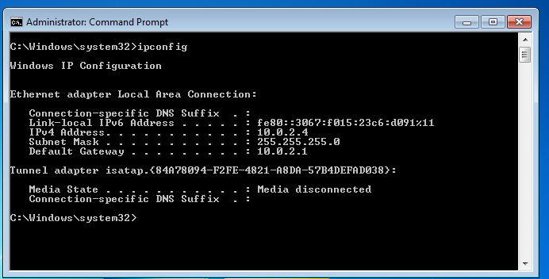
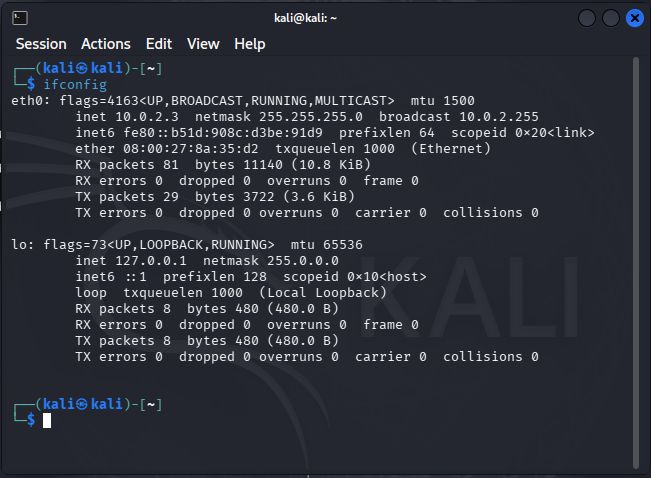
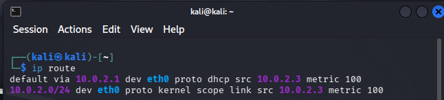
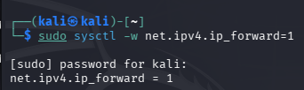
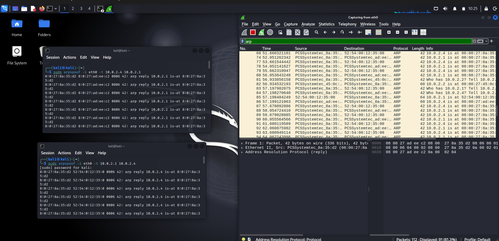
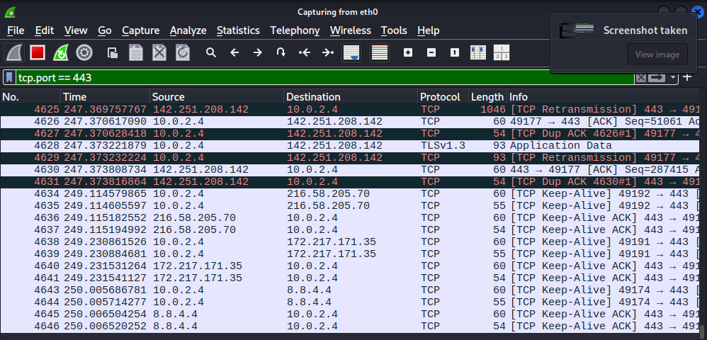

# Arp-spoofing-lab-environment

This repository documents my educational lab demonstrating an ARP Poisoning (Man-in-the-Middle) attack. I conducted this lab in a controlled, isolated virtual environment to understand network vulnerabilities and packet interception.

## Lab Environment
* **Attacker Machine:** Kali Linux (`10.0.2.3`)
* **Target Machine:** Windows 7 (`10.0.2.4`)
* **Default Gateway:** `10.0.2.1`
* **Tools Used:** `ifconfig`, `ip route`, `sysctl`, `arpspoof`, Wireshark.

## Execution Steps

### 1. Network Reconnaissance
First, I verified the IP configurations of my machines to map out the local network.
* I checked my target's IP address (Windows 7), which was `10.0.2.4`.



* I checked my Kali Linux IP address, which was `10.0.2.3` on the `eth0` interface.



* I identified the network's default gateway as `10.0.2.1`.



### 2. Enabling IP Forwarding
To ensure my target machine maintained internet access during the attack (allowing me to act as a seamless router rather than causing a Denial of Service), I enabled IPv4 packet forwarding on my Kali machine:

```bash
sudo sysctl -w net.ipv4.ip_forward=1
```



### 3. Launching the ARP Spoofing Attack
I used `arpspoof` to manipulate the ARP tables of both the target and the gateway. I opened two separate terminal instances on my Kali machine to send forged ARP replies continuously.

In the first terminal, I tricked the target into believing my Kali machine was the gateway:

```bash
sudo arpspoof -i eth0 -t 10.0.2.4 10.0.2.1
```

In the second terminal, I tricked the gateway into believing my Kali machine was the target:

```bash
sudo arpspoof -i eth0 -t 10.0.2.1 10.0.2.4
```

Wireshark confirmed the broadcast of these malicious ARP packets, showing my Kali MAC address claiming the IP addresses of both the gateway and the target.



### 4. Traffic Generation & Interception
* On my Windows 7 target machine, I opened a web browser and navigated to YouTube to generate standard HTTPS traffic.


* On my Kali machine, I ran Wireshark and captured packets on the `eth0` interface.
* Because I successfully poisoned the ARP caches, all outbound and inbound traffic for the target routed directly through my Kali machine. By filtering for `tcp.port == 443`, I successfully intercepted and analyzed the TCP and TLSv1.3 application data flowing between the target (`10.0.2.4`) and external internet servers.



---
**Disclaimer:** This lab was performed strictly for educational purposes within a local, authorized virtual environment to study network security principles.
